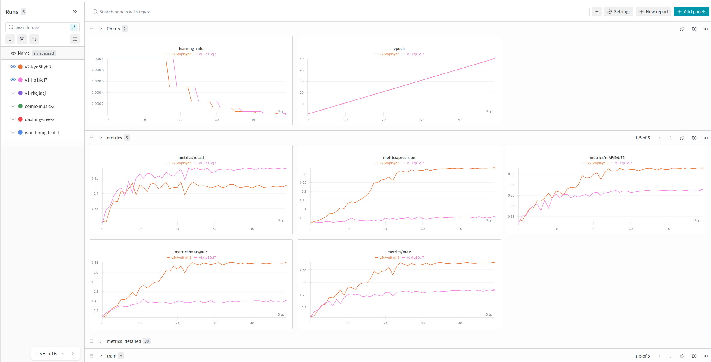

# Barcode Detection System

## Exploratory Data Analysis
The notebook can be found at `notebooks/eda.ipynb`. I examined the total number of images in each split, the distribution of the number of barcodes in each image, the image sizes and aspect ratios, the distribution of the bounding box sizes, and looked for any edge cases.

- Total number of images in each split - Ensure that train/test split has been performed appropriately.
- Distribution of number of barcodes in each image - We can see that the majority have only 1 barcode per image. There are some 0 barcode imgaes, but they are probably mislabelled (from a cursory exploration of images that fit this category). However, some of these images have multiple barcodes but only 1 labelled. I was concerned that it would affect the model training, as a background with a barcode (but no label) would be identified as non-barcode/background for the loss function. Based on the YOLOv12 pretrained baseline, most images with multiple barcodes had all of them recognised. A CNN based model probably is robust to this specific training noise.
- Image sizes and aspect ratios - Helps to understand the effect of resizing or letterboxing during preprocessing.
- Distribution of the bounding box sizes - A larger variance of sizes from very thin (e.g. 1:1000 aspect ratio) to very square (e.g. 1:1 aspect ratio) could make it difficult for the bounding box regression.

Edge cases:
- Some bounding boxes were outside of the images. A clipping helper function was included in the scripts to ensure proper training.
- Some images have partial barcodes that are annotated.

## Evaluation

Precision, Recall, mAP0.5:0.95, and mAP@0.5 were chosen, as they are standard for object detection models. This task is fairly standard, so I did not think any other metrics were very important to include. Additionally, using standard metrics allows us to compare this model with other models that also report the same metrics.

Precision is defined as TP/(TP+FP), and is the ability of the model to avoid false positives. Recall is defined as TP/(TP+FN), and is the ability of the model to avoid false negatives. In the context of object detection, a detection is only correct if it overlaps enough (IoU >= 0.5) with the ground truth label.

Metrics such as mAP, Precision and Recall are tracked on weights and biases, as can be seen in the image below.



An inference script can be found at `src/inference.py`

```
Usage:
For the v1 model:
python src/inference.py --checkpoint checkpoints_v1/latest_model.pt --image barcode_dataset/images/val/barcode_detector_test_025569.jpg

For the v2 model:
python src/inference_v2.py --checkpoint checkpoints_v2/latest_model.pt --image barcode_dataset/images/val/barcode_detector_test_025569.jpg
```

## Architecture

### Overview

This system implements a custom deep learning model for barcode detection, employing a grid-based single-stage object detection architecture inspired by the YOLO (You Only Look Once) paradigm. The model is designed for single-class detection tasks and achieves real-time inference capabilities through a streamlined architectural design.

### Model Architecture

#### Detection Paradigm

The detector follows a YOLO v1-style architecture, characterized by:

- **Grid-based spatial partitioning**: The input image is divided into an S×S grid (S=7), where each grid cell is responsible for detecting objects whose center falls within that cell's boundaries.

- **Direct bounding box prediction**: Unlike two-stage detectors (e.g., R-CNN family), this architecture performs detection in a single forward pass, eliminating the need for region proposal networks and subsequent refinement stages.

- **Multi-box prediction per cell**: Each grid cell predicts B bounding boxes (B=2), allowing multiple detections within the same spatial region to handle potential overlapping instances.

- **Unified prediction tensor**: The model outputs a tensor of shape (S, S, B×5+C), where each bounding box is parameterized by five values (x, y, w, h, confidence) and C represents the number of classes.

#### Network Components

**Backbone Network (Feature Extraction)**

The architecture employs ResNet-18 as its convolutional backbone for feature extraction:

- **Base architecture**: ResNet-18 pretrained on ImageNet (11.7M parameters)
- **Modification**: Final fully-connected layer and average pooling removed, retaining only convolutional layers
- **Output**: Feature maps of dimensionality (512, H/32, W/32), where H and W are input dimensions
- **Transfer learning**: Pretrained weights provide robust low-level and mid-level feature representations

**Spatial Adaptation Layer**

An adaptive average pooling layer transforms variable-sized feature maps into a fixed grid structure:

- **Operation**: AdaptiveAvgPool2d(grid_size, grid_size)
- **Input**: (batch, 512, H/32, W/32)
- **Output**: (batch, 512, 7, 7)
- **Purpose**: Ensures consistent spatial dimensions regardless of input image size

**Detection Head**

A sequence of convolutional layers transforms backbone features into detection predictions:

```
Layer 1: Conv2d(512 → 256, kernel=3, padding=1) + BatchNorm2d + LeakyReLU(0.1)
Layer 2: Conv2d(256 → 128, kernel=3, padding=1) + BatchNorm2d + LeakyReLU(0.1)
Layer 3: Conv2d(128 → N, kernel=1)
```

where N = B×5 + C (for B=2 boxes and C=1 class, N=11)

- **Batch Normalization**: Provides training stability and enables higher learning rates
- **LeakyReLU activation**: Prevents dying ReLU problem with slope 0.1 for negative values
- **1×1 final convolution**: Performs dimensionality reduction without spatial information loss

#### Model Versions

**Version 1 (V1)**

- **Output activation**: Global sigmoid activation applied to all predictions
- **Loss function**: Mean Squared Error (MSE) for all components
- **Characteristics**: Simple, unified treatment of all prediction tasks

**Version 2 (V2) - Current Production Model**

- **Output activation**: Selective activation strategy
  - Bounding box coordinates (x, y, w, h): No activation (continuous regression)
  - Objectness confidence: Sigmoid activation (binary probability)
  - Class probability: Sigmoid activation (binary probability)

- **Loss function**: Hybrid loss approach
  - Binary Cross-Entropy (BCE) for confidence and class predictions
  - Mean Squared Error (MSE) for bounding box coordinates

- **Advantages**: 
  - Improved probability calibration for confidence scores
  - Better alignment between loss function and prediction task characteristics
  - More numerically stable gradients during training

### Prediction Format

Each grid cell produces predictions with the following structure:

```
[box1_x, box1_y, box1_w, box1_h, box1_confidence,
 box2_x, box2_y, box2_w, box2_h, box2_confidence,
 class_probability]
```

**Coordinate Encoding**:
- (x, y): Center coordinates relative to grid cell (values in [0, 1])
- (w, h): Width and height relative to full image (values in [0, 1])
- confidence: Objectness score indicating P(object) × IoU
- class_probability: Probability of barcode class given object presence

### Input Specifications

- **Image dimensions**: 448×448 pixels (resized from arbitrary input sizes)
- **Normalization**: ImageNet statistics (mean=[0.485, 0.456, 0.406], std=[0.229, 0.224, 0.225])
- **Channel format**: RGB, range [0, 1]

### Loss Function

The training objective employs a weighted multi-task loss:

```
L_total = λ_coord · L_coord + L_conf_obj + λ_noobj · L_conf_noobj + L_class
```

**Components**:

1. **Coordinate Loss** (L_coord): MSE on bounding box predictions (λ_coord = 5.0)
2. **Objectness Loss** (L_conf): 
   - Object cells: BCE between predicted and target confidence
   - No-object cells: BCE with reduced weight (λ_noobj = 0.5)
3. **Classification Loss** (L_class): BCE on class probability predictions

**Weighting Rationale**:
- λ_coord > 1: Emphasizes spatial accuracy over confidence calibration
- λ_noobj < 1: Mitigates class imbalance (most grid cells contain no objects)

### Post-Processing

Inference pipeline applies the following post-processing steps:

1. **Confidence thresholding**: Filter predictions below minimum confidence (default: 0.5)
2. **Non-Maximum Suppression (NMS)**: Remove redundant overlapping detections using IoU threshold (default: 0.4)
3. **Coordinate denormalization**: Convert relative coordinates to absolute pixel values

### Performance Characteristics

- **Inference time**: ~140-200ms per image (CPU, single-threaded)
- **Model size**: ~45MB (FP32 weights)
- **Memory footprint**: ~2GB during inference (CPU)
- **Throughput**: ~5-7 FPS (CPU), scalable with GPU acceleration

### Design Rationale

**Architectural Choices**:

1. **YOLO v1 paradigm**: Provides balance between speed and accuracy for single-class detection
2. **ResNet-18 backbone**: Lightweight architecture suitable for resource-constrained deployment
3. **Grid size 7×7**: Adequate spatial resolution for typical barcode sizes (each cell covers 64×64 pixels)
4. **Two boxes per cell**: Handles potential overlapping detections while maintaining computational efficiency
5. **Hybrid loss (V2)**: Aligns loss functions with underlying task characteristics (regression vs. classification)

**Trade-offs**:

- Spatial granularity: 7×7 grid may miss very small barcodes (<64 pixels)
- Single-scale detection: No multi-scale feature pyramid (could improve small object detection)
- Backbone capacity: ResNet-18 trades accuracy for speed (deeper backbones would improve performance)

